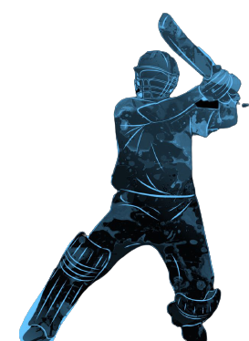

<div id = 'top'></div>


<!-- PROJECT LOGO -->
<br />
<div align="center">
   <a href="https://github.com/danuja-wije/Crick-Analys">
     
   </a>
   <h1 align="center">Crick Analys</h1>
  <p align="center">
    Online player forecast & predictor
    <br />
    <a href="https://mysliit-my.sharepoint.com/:b:/g/personal/it19957180_my_sliit_lk/EVdAB4g0WaJMs_sFaNT7TH0BSMhfxFuKnR7BQlk42433Rw?e=t0Md2a"><strong>Explore the docs »</strong></a>
    <br />
    <br />
    <a href="https://crick-analys.herokuapp.com/">View Demo</a>
    ·
    <a href="https://github.com/danuja-wije/Crick-Analys/issues">Report Bug</a>
    ·
    <a href="https://github.com/danuja-wije/Crick-Analys/issues">Request Feature</a>
  </p>
</div>


<!-- TABLE OF CONTENTS -->
<details>
  <summary>Table of Contents</summary>
  <ol>
    <li>
      <a href="#About The Project">About The Project</a>
      <ul>
        <li><a href="#Built With">Built With</a></li>
      </ul>
    </li>
    <li>
      <a href="#Getting Started">Getting Started</a>
      <ul>
        <li><a href="#p">Prerequisites</a></li>
        <li><a href="#i">Installation</a></li>
      </ul>
    </li>
    <li><a href="#u">Usage</a></li>
    <li><a href="#c">Contributing</a></li>
    <li><a href="#l">License</a></li>
    <li><a href="#co">Contact</a></li>
  </ol>
</details>


<!-- ABOUT THE PROJECT -->
## About The Project
<div id='About The Project'></div>


<div align="center">
    
 </div>

Cricket is a world-famous game which is also known as gentlemen’s sport. It is also the second 
most popular sport in the world. The objective of this game is to score more runs than the 
opposing team. There are three types of international cricket matches. They are Test match, One 
day International(ODI) and T20 International(T20I). A cricket match is divided into periods 
called innings. A Test matches has four innings including two innings each for one team and 
played through the cause of five days. A ODI match has two innings of 50 Overs each and a 
T20I match has two innings of 20 overs each. 
When exploring about the problems that most less experienced teams face in international 
matches is that they do not analyze the opposing team’s players and batting partnership that 
would be built among the players before start of the match. Even though they have a well 
performing team the probability of winning may decrease. 
Also, in some situations, they should choose the top scorer for each batting position for that 
particular match. They should examine who is bowling at that moment and who has the best 
score and playing forecast for each over.
Hence these are identified as some concerns that less experienced teams have to face during 
international matches, these models will be an enormous advantage for less experienced teams to 
analyze and examine the data and come up with better outcomes to organize their team to 
increase the winning rate and performance of the team during international matches

* Problems <br>
The most common problem that teams have during international matches is that they do not 
analyze the opposition team's players and batting partnership before the match begins. Even 
if they have a strong team, their chances of winning may be reduced.
It is always difficult to select the best team for a specific series, and teams always lose when 
they play at a foreign ground. Their outcome is also affected by the inning they played. As a 
result, it is always difficult to select the best team for a specific series.
* Solutions <br>
To predict the score of batman for an over, by checking the forecast and selecting the best 
batsman for that particular position and increase the winning rate of the match.
To evaluate winning patterns of the opposing team in different conditions such as are they 
playing in motherland or in a foreign country, are they playing 1
st inning or 2nd inning. So 
that the cricket board can identify the best team for that particular series

### Built With
<div id='Built With'></div>

Dash is a python framework created by plotly for creating interactive web applications
<div align="center" style={'display':'flex'}>
 
   
  
   
 </div>

* [Python 3](https://www.python.org/downloads/)
* [Dash](https://plotly.com/dash/)
* [React.js](https://reactjs.org/)
* [Bootstrap](https://getbootstrap.com)
* [Flask](https://flask.palletsprojects.com/en/2.0.x/)

<p align="right">(<a href="#top">back to top</a>)</p>


<!-- GETTING STARTED -->
## Getting Started
<div id='Getting Started'></div>


### Prerequisites
<div id='p'></div>
[Download](https://www.python.org/downloads/) Python 3 to setting up this project locally.


### Installation
<div id='i'></div>

1. install python 3 [https://example.com](https://www.python.org/downloads/)
2. Clone the repo
   ```sh
   git clone https://github.com/danuja-wije/Crick-Analys.git
   ```
3. Install python Libraries
 * colorama==0.4.4
 * cycler==0.10.0
 * dash==2.0.0
 * dash-bootstrap-components==0.13.1
 * dash-core-components==2.0.0
 * dash-extensions==0.0.60
 * dash-html-components==2.0.0
 * dash-table==5.0.0
 * Flask==2.0.1
 * Flask-Caching==1.10.1
 * Flask-Compress==1.10.1
 * gunicorn==20.1.0
 * imbalanced-learn==0.8.1
 * imblearn==0.0
 * itsdangerous==2.0.1
 * Jinja2==3.0.1
 * joblib==1.0.1
 * kiwisolver==1.3.2
 * MarkupSafe==2.0.1
 * matplotlib==3.4.3
 * mlxtend==0.19.0
 * more-itertools==8.10.0
 * numpy==1.21.2
 * pandas==1.3.3
 * Pillow==8.3.2
 * plotly==5.3.1
 * pyparsing==2.4.7
 * python-dateutil==2.8.2
 * pytz==2021.3
 * scikit-learn==1.0
 * scipy==1.7.1
 * six==1.16.0
 * tenacity==8.0.1
 * threadpoolctl==3.0.0
 * Werkzeug==2.0.1
 * pip
  ```sh
  pip install dash==2.0.0
  ```
  ```sh
  pip install plotly==5.3.1
  ```
  ```sh
  pip install dash-bootstrap-components==0.13.1
  ```
  ```sh
  pip install dash-extensions==0.0.60
  ```
  ```sh
  pip install mlxtend==0.19.0
  ```
  ```sh
  pip install numpy==1.21.2
  ```
  ```sh
  pip install pandas==1.3.3
  ```
  ```sh
  pip install imblearn==0.0
  ```
  ```sh
  pip install scipy==1.7.1
  ```
  ```sh
  pip install scikit-learn==1.0
  ```
4. run index.py 

<p align="right">(<a href="#top">back to top</a>)</p>


<!-- USAGE EXAMPLES -->
## Usage
<div id = 'u'></div>

### Home
<div align="center" style={'display':'flex'}>
    
    
 </div>


_For more examples, please refer to the [Documentation](https://mysliit-my.sharepoint.com/:b:/g/personal/it19957180_my_sliit_lk/EVdAB4g0WaJMs_sFaNT7TH0BSMhfxFuKnR7BQlk42433Rw?e=t0Md2a)_

<p align="right">(<a href="#top">back to top</a>)</p>


<!-- CONTRIBUTING -->
## Contributing
<div id = 'c'></div>

* IT19223186 - Ekanayake E.M.B.S.
* IT19157306 - Panditharathna P.A.N.D.
* IT19960296 - Deen T.R.
* IT19957180 - Wijerathna P.M.D.C.B.
* IT19000336 - Mudannayake I.G.M.J.
* IT19391946 - Wijerathne H.P.A.T.

<p align="right">(<a href="#top">back to top</a>)</p>

<!-- LICENSE -->
## License
<div id='l'></div>

Distributed under the MIT License. See `LICENSE.txt` for more information.

<p align="right">(<a href="#top">back to top</a>)</p>


<!-- CONTACT -->
## Contact
<div id = 'co'></div>
Name - [@Danuja Wijerathna](https://www.linkedin.com/in/danuja-wijerathna-04774a20a/) - danujawijerathne45@gmail.com

Project Link: [https://github.com/danuja-wije/Crick-Analys](https://github.com/danuja-wije/Crick-Analys)


<!-- ACKNOWLEDGMENTS -->
## Acknowledgments
This is a project done for the Fundamentals of Data Mining (IT3051) of BSc.(Hons.) Degree in Information Technology in Sri Lanka Institute of Information Technology


<p align="right">(<a href="#top">back to top</a>)</p>


